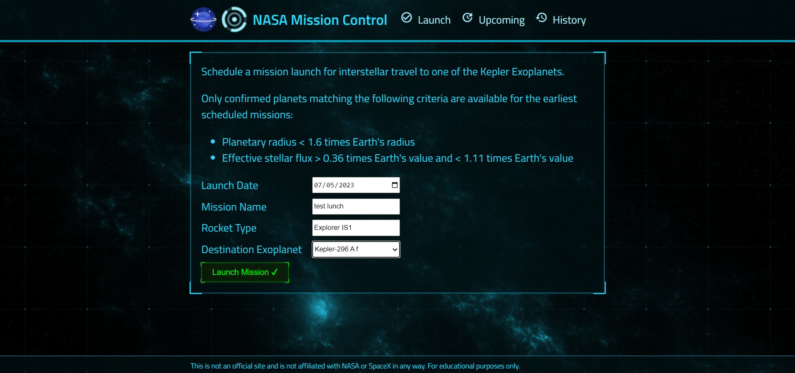

# NASA Project

This project is a Node.js and Express.js application that reads a CSV file from the NASA website to find habitable planets. It also utilizes the SpaceX API to retrieve mission status data and combines all of this information into a single project.



here you can see all the upcoming and history of the rocket that NASA sent to space.
also, you have a list of habitable planets that you can set your rocket to throw to these planets and cancel the upcoming launch.


## Installation

To install this project, you can follow these steps:

1. Clone the repository to your local machine
```bash
 git clone https://github.com/smh-kneonix/nasa-project
 ```

2. run mongo db with yourself or just run it by docker-compose
```bash
 docker-compose up
 ```

 > HINT: if you want to use your own server make sure config the env

3. Install the necessary dependencies by running npm install
```bash
 npm install
 ```
4. Start the application by running the server
```bash
 npm run server
 ```

## Usage

Once the application is running, you can access it by navigating to http://localhost:8000 in your web browser. From there, you can explore the habitable planets and view mission status data from SpaceX.


## Docker Container

Docker container has been added to the project to make deploying and running the application in different environments easier. The container includes all the necessary dependencies and configurations, making it easy to set up and run the application on any machine that supports Docker. This also helps to ensure consistency across different environments and reduces the risk of configuration errors.

> If you use docker make sure to follow these steps


1. run docker on your OS
2. build docker image
```bash
  docker build . -t dockerUserName/nasa-project
 ```
3. run the docker image
```bash
 docker run -it -p 8000:8000 dockerUserName/nasa-project
 ```

<br>

## Docker Container

Docker container has been added to the project to make it easier to deploy and run the application in different environments. The container includes all the necessary dependencies and configurations, making it easy to set up and run the application on any machine that supports Docker. This also helps to ensure consistency across different environments and reduces the risk of configuration errors.

> if you use docker make sure follow these steps


1. open the docker
2. build docker image
```bash
  docker build . -t dockerUserName/nasa-project
 ```
3. run the docker you build
```bash
 docker run -it -p 8000:8000 dockerUserName/nasa-project
 ```

<br>

## Additional Features
<details>
<summary> Features details </summary>

<br>
In addition to the existing features, the following features have been added to the project:

### Error Handling

Error handling has been implemented throughout the application to ensure that any errors that occur are handled gracefully. This includes handling errors when reading the CSV file, retrieving data from the SpaceX API, and any other errors that may occur during the course of running the application.

### MVC Design Pattern

The application has been designed using the Model-View-Controller (MVC) design pattern. This helps to keep the code organized and makes it easier to maintain and extend in the future.

### RESTfull API

The application now exposes a REST API that allows users to retrieve data from the application programmatically. This API includes endpoints for retrieving a list of habitable planets, retrieving mission status data from SpaceX, and more.
><a href="https://www.postman.com/kneonix/workspace/nasa-project">you can see all the request from postman</a>

### Cross-Origin Resource Sharing (CORS)

Cross-Origin Resource Sharing (CORS) has been implemented using the <a href="https://www.npmjs.com/package/cors">cors</a> package. This allows the application to be accessed from other domains, making it easier to integrate with other applications.

### Logging system

A logging system has been implemented using the <a href="https://www.npmjs.com/package/morgan">morgan</a> package. This logs all requests and responses to the console, making it easier to debug issues that may arise.

### performance

The <a href="https://www.npmjs.com/package/pm2">pm2</a> package has been added as a local project dependency to improve performance by utilizing the file system. This allows for faster read and write operations when working with large amounts of data.

<br>

To use high performance, Enter this command

```bash
 npm run cluster --prefix server
 ```

### MongoDB Database

The application uses a MongoDB database to store and retrieve data. This is implemented using the <a href="https://www.npmjs.com/package/mongoose">mongoose</a> package, which provides an easy-to-use interface for working with MongoDB.

### SpaceX API

The application now utilizes the <a href="https://github.com/r-spacex/SpaceX-API">SpaceX API</a> to retrieve mission status data. This is implemented using the <a href="https://www.npmjs.com/package/axios">axios</a> package, which provides an easy-to-use interface for making HTTP requests.

### API Pagination

API pagination has been implemented to limit the amount of data returned by the API. This helps to improve performance and reduce the amount of data that needs to be transferred over the network.

### API Testing

API testing has been implemented using the <a href="https://www.npmjs.com/package/mongoose">jest</a> and <a href="https://www.npmjs.com/package/supertest">supertest</a> packages. This allows for automated testing of the API endpoints to ensure that they are working correctly.
</details>

<br>

## Front-End

The front end of this project was built by the Zero to Mastery Nodejs course. It provides a user-friendly interface for exploring the data gathered by the application.
